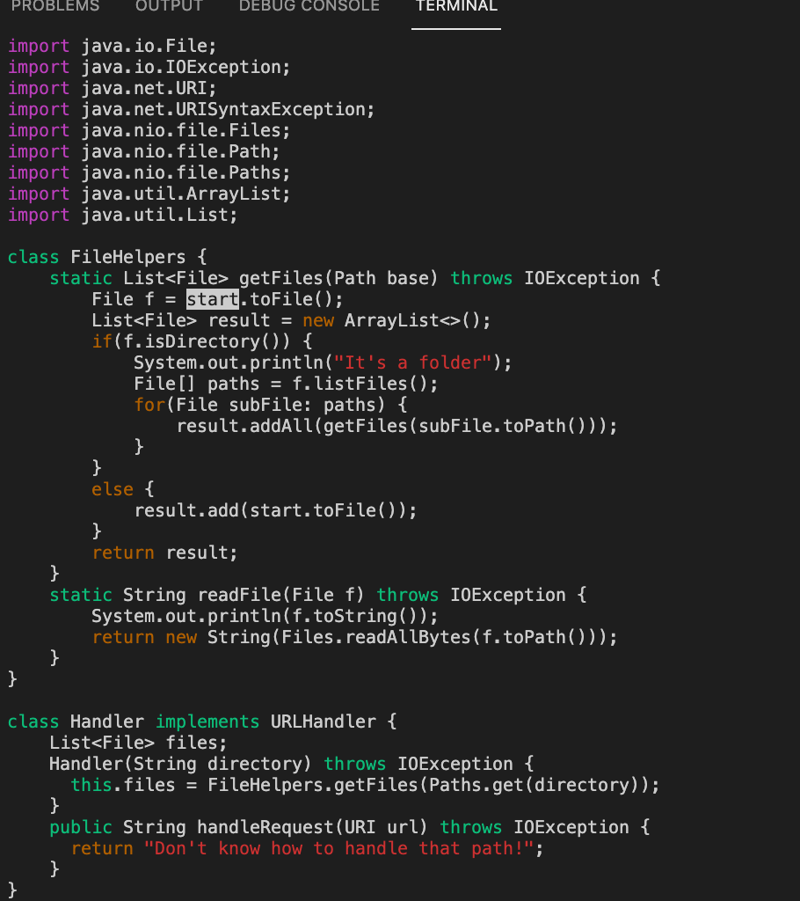

# Lab Report 4

## Part 1
---
// Task : In the DocSearchServer.java file, change the name of the *start* parameter and its uses to *base*.

// My lab group came up with the shortest sequences of keys to press to complete this task with vim commands that were less than 30 keystrokes. 

The steps are below

1. First, there are two things to check. Make sure that you are in visual mode, if not, `esc`
out to exit insert mode. Then make sure that your cursor is at the top of the file, so that we may start off with finding the *first* instance of the word "start" that we want to replace. If not at the top, hold the key `option` and click your cursor to the top. 

2. There is a manual way to search for every instance of the word "start" in our file and replacing it every time, but to shorten the keystrokes, we will feed our commands to search and replacing with another word into one line of command. The command is below. 

```
:%s/start/base/gc
```


3. Above, as soon as the command is typed in, the first instance of "start" is already highlighted to be edited. 
As soon as you press 'enter', a green prompt is shown on the bottom, instructing us to input 'y' or 'n' for replacing each instace of the "start" word with "base". 


4. Now, we just need to input `y` three times to replace the first three instances of the word, and a `n` for the last instance, because we only want the replacement to happen within the class FileHelpers. 

// Changes made to the file in sequence as `y` and `n` is inputed by the user is shown in the screenshots below. 

> We can see that the first *start* has been replaced.


> We can see that the second *start* has been replaced.


> We can see that the third *start* has been replaced. 


> After prompting `n`, the last *start* has not been replaced as intended, and is kept. Since there are no more *start* instances to replace, the command has terminated and there is a summary note of the changes and edits to the file that has been just made. 


> In summary, the total keystrokes has been 28; actual typed in command is below.

> :%s/start/base/gc<Enter>yyyn


## Part 2
---


// Questions to Answer
1. Which of these two styles would you prefer using if you had to work on a program that you were running remotely, and why?
2. What about the project or task might factor into your decision one way or another? (If nothing would affect your decision, say so and why!)

